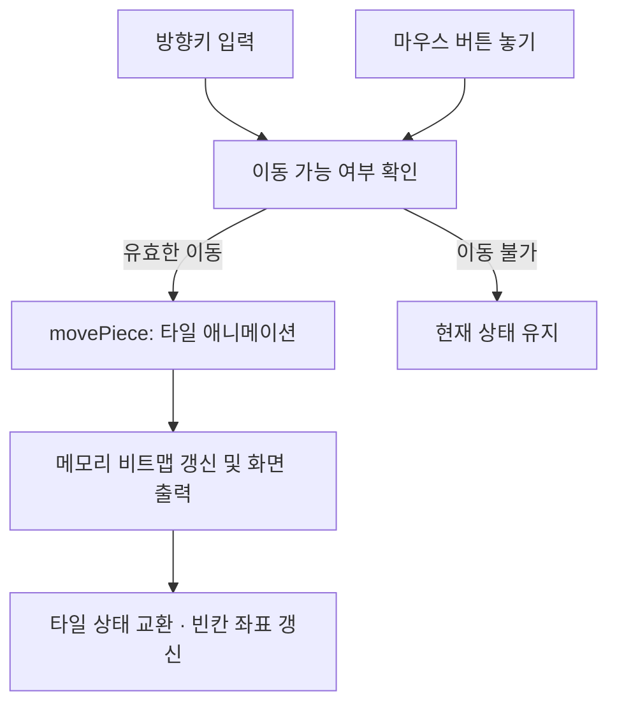

<div align="center">

# 🧩 CH Puzzle

### 나만의 사진으로 만드는 4 × 4 슬라이딩 퍼즐

**C++ · MFC · GDI+ · Windows Desktop**


사진을 조각으로 나누고, 빈칸을 이용해 타일을 움직이는 Windows 퍼즐 프로젝트입니다.

[프로젝트 소개](#-프로젝트-소개) · [조작 방법](#-조작-방법) · [구현 구조](#-구현-구조) · [실행 방법](#-실행-방법) · [사진 바꾸기](#-사진-바꾸기)

</div>

---

## 📘 프로젝트 소개

**CH Puzzle**은 비트맵 이미지를 활용한 **4×4 슬라이딩 퍼즐**입니다. C++과 MFC로 데스크톱 화면 및 입력 이벤트를 처리하고, GDI+로 이미지 조각과 이동 애니메이션을 그립니다.

퍼즐판은 **15개 타일과 1개 빈칸**으로 구성됩니다. 빈칸에 인접한 타일을 움직이면서 이미지의 배치를 바꿀 수 있으며, 키보드와 마우스 입력을 모두 지원합니다.

> 현재는 이미지 분할·타일 이동을 구현한 프로토타입입니다. 무작위 섞기와 완성 판정은 구현되어 있지 않으며, 사진은 BMP 리소스를 교체한 뒤 다시 빌드하는 방식으로 변경합니다.

## ✨ 주요 기능

| 기능 | 구현 내용 |
| --- | --- |
| **이미지 기반 퍼즐** | 실행 파일의 BMP 리소스를 불러와 타일로 표시 |
| **4×4 상태 관리** | `state[4][4]` 배열로 타일 번호와 빈칸 관리 |
| **키보드 조작** | 방향키로 인접 타일 이동 |
| **마우스 조작** | 빈칸에 인접한 타일을 클릭하여 이동 |
| **이동 애니메이션** | 타일을 13px씩 4단계로 이동 |
| **메모리 비트맵 렌더링** | 메모리에서 그린 보드를 `OnPaint()`로 화면에 출력 |
| **입력 상태 관리** | `isClicked`, `isMoving`으로 클릭과 이동 상태 구분 |

## 🎮 조작 방법

퍼즐 영역에 포커스를 둔 상태에서 방향키를 누르거나 빈칸 옆의 타일을 클릭합니다.

| 입력 | 동작 |
| --- | --- |
| **←** | 빈칸 오른쪽 타일을 왼쪽으로 이동 |
| **→** | 빈칸 왼쪽 타일을 오른쪽으로 이동 |
| **↑** | 빈칸 아래쪽 타일을 위로 이동 |
| **↓** | 빈칸 위쪽 타일을 아래로 이동 |
| **마우스 왼쪽 클릭 후 놓기** | 놓은 위치의 타일이 빈칸과 인접하면 이동 |

방향키는 **빈칸이 아닌 타일의 이동 방향**을 기준으로 합니다. 이동할 타일이 없으면 동작하지 않으며, 대각선 타일은 이동할 수 없습니다.

## ⚙️ 구현 구조

### 입력에서 화면 갱신까지



### 상태 표현

| 변수 | 역할 |
| --- | --- |
| `state[4][4]` | 타일 번호를 저장하며 `0`은 빈칸을 의미 |
| `loc0` | 빈칸 좌표, 초기값은 `(3, 3)` |
| `board` | 보드 위치 및 크기: `(100, 50)`, `206×206` |
| `pimage` | 리소스에서 읽은 원본 이미지 |
| `pmembitmap` | 보드 렌더링용 메모리 비트맵 |
| `isClicked` | 마우스 버튼 누름 상태 |
| `isMoving` | 타일 이동 처리 상태 |

### 인접 타일 판정

클릭한 타일과 빈칸의 **맨해튼 거리**가 1인지 확인합니다.

```cpp
abs(loc.x - loc0.x) + abs(loc.y - loc0.y) == 1
```

가로 또는 세로로 한 칸 떨어져 있을 때만 이동을 허용하는 조건입니다.

### 타일 애니메이션

`movePiece()`는 이전 위치를 덮어 잔상을 지우고, 이동한 위치에 이미지 조각을 다시 그립니다. 각 단계에서 약 60ms를 대기하며 13px씩 네 번, 총 52px를 이동합니다.

화면 갱신이 끝나면 타일 값과 빈칸 값의 교환을 수행하고 `loc0`를 갱신합니다. 현재 구현은 UI 스레드의 반복 대기를 사용하며, 타이머 기반 애니메이션은 향후 개선할 수 있습니다.

## 🗂️ 코드 구성

| 파일 | 역할 |
| --- | --- |
| [CH Puzzle.sln](CH%20Puzzle.sln) | Visual Studio 솔루션 |
| [CH PuzzleView.cpp](CH%20Puzzle/CH%20PuzzleView.cpp) | 이미지 로딩, 렌더링, 입력 처리, 타일 이동 |
| [CH PuzzleView.h](CH%20Puzzle/CH%20PuzzleView.h) | 퍼즐 상태와 이벤트 핸들러 선언 |
| [CH Puzzle.cpp](CH%20Puzzle/CH%20Puzzle.cpp) | MFC 애플리케이션 초기화 |
| [CH PuzzleDoc.cpp](CH%20Puzzle/CH%20PuzzleDoc.cpp) | MFC 문서 클래스 |
| [MainFrm.cpp](CH%20Puzzle/MainFrm.cpp) | 메인 프레임 구성 |
| [CHPuzzle.rc](CH%20Puzzle/CHPuzzle.rc) | 비트맵, 메뉴, 아이콘 등 리소스 정의 |
| [res/](CH%20Puzzle/res) | BMP 이미지 및 아이콘 |

## 🚀 실행 방법

### 준비 환경

- Windows
- Visual Studio 2022
- **C++를 사용한 데스크톱 개발** 워크로드
- **MSVC v143용 MFC 구성 요소** 및 Windows SDK

프로젝트는 `v143` 도구 집합과 동적 MFC 연결을 사용합니다.

### 빌드 및 실행

```powershell
git clone https://github.com/path0971/CH-Puzzle.git
cd CH-Puzzle
```

1. `CH Puzzle.sln`을 Visual Studio에서 엽니다.
2. 빌드 구성을 **Debug**, 플랫폼을 **x64**로 선택합니다.
3. **솔루션 빌드**를 실행합니다.
4. `Ctrl + F5`로 실행합니다.
5. 퍼즐판에서 방향키와 마우스 조작을 확인합니다.

MFC 관련 헤더나 라이브러리를 찾지 못하면 Visual Studio Installer에서 MFC 구성 요소가 설치되어 있는지 확인합니다. 이 문서의 실행 절차는 프로젝트 설정을 기준으로 하며, Windows에서의 빌드·플레이 검증 결과를 의미하지는 않습니다.

## 🖼️ 사진 바꾸기

현재 기본 이미지는 다음 리소스로 연결되어 있습니다.

```text
IDB_BITMAP2 → res\profileImage.bmp
```

**Visual Studio 리소스 보기에서 `IDB_BITMAP2`에 연결된 BMP를 교체**하거나, `CH Puzzle/res/profileImage.bmp`를 원하는 BMP 이미지로 교체한 뒤 다시 빌드합니다.

다른 리소스를 사용하려면 `CH PuzzleView.cpp`의 이미지 로딩 코드에서 리소스 ID를 변경할 수 있습니다.

```cpp
Gdiplus::Bitmap::FromResource(
    AfxGetInstanceHandle(),
    (WCHAR*)MAKEINTRESOURCE(IDB_BITMAP2)
);
```

현재 이동 렌더링은 원본 타일 크기를 `186×186`으로 고정하고, 초기 렌더링은 별도 비례 계산을 사용합니다. 임의 크기의 사진을 정확히 표시하려면 **두 경로의 타일 인덱스와 분할 좌표 계산을 함께 정리**해야 합니다.

실행 중 파일 선택을 통한 이미지 교체와 JPEG·PNG 자동 변환은 아직 구현되어 있지 않습니다.

## 🌱 개선 계획

기존 README의 계획을 포함하여, 현재 구현과 구분되는 확장 방향입니다.

- [ ] 플레이 시간 표시 및 타이머
- [ ] JPEG·PNG 파일의 BMP 자동 변환
- [ ] 여러 스테이지와 진행 상태 관리
- [ ] 퍼즐 완성 판정 및 축하 메시지
- [ ] 풀 수 있는 상태를 유지하는 무작위 섞기
- [ ] 이미지 크기에 맞춘 타일 분할 계산 통일
- [ ] UI 타이머 기반 이동 애니메이션

---

<div align="center">

**CH Puzzle**<br>
이미지 처리와 Windows 이벤트 프로그래밍으로 만드는 슬라이딩 퍼즐

</div>
